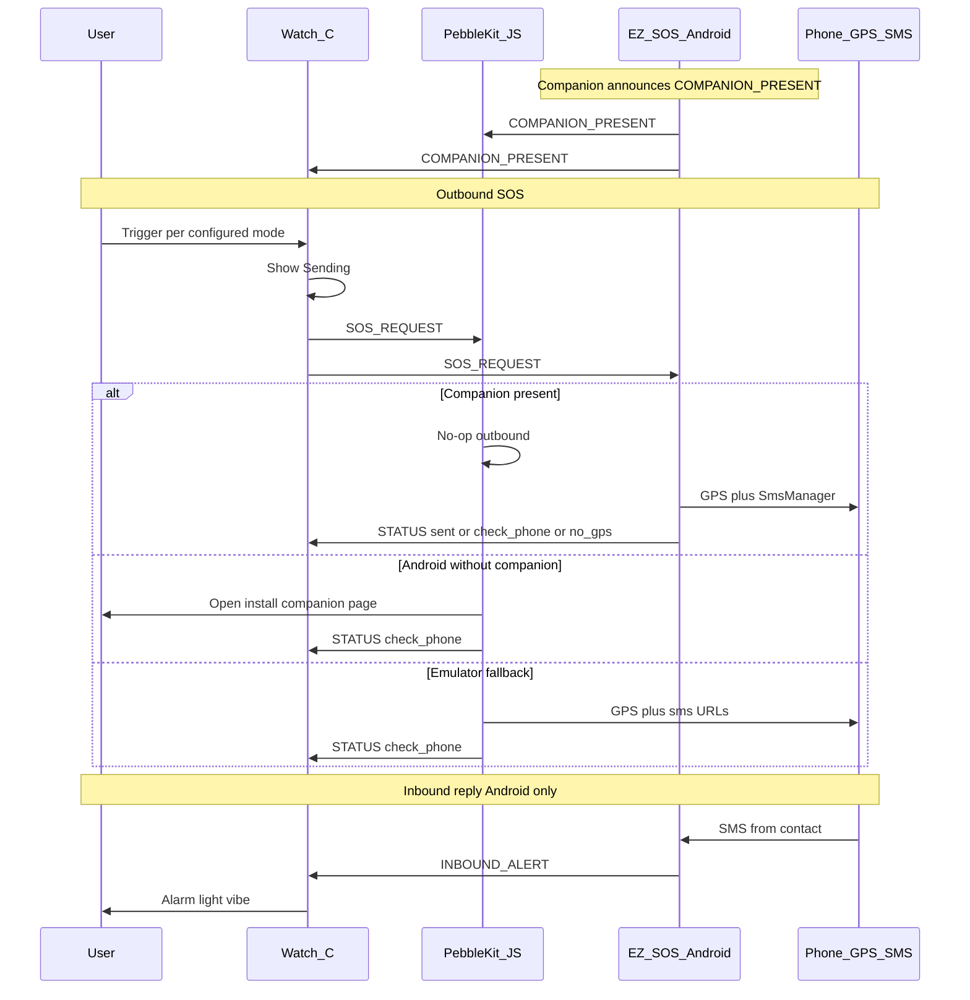

# EZ SOS App Design

**Date:** 2026-07-30  
**Status:** Approved (revised — Android-owned contacts)  
**Prerequisite:** Phase 1 complete — Dev Container + skeleton (`docs/superpowers/specs/2026-07-30-ez-sos-devcontainer-design.md`)

## Purpose

Replace the broken [SmSOS](https://apps.repebble.com/smsos_54d417514ba76441e5000032) experience with a modern Pebble SOS watchapp:

1. User triggers SOS on the watch
2. Phone obtains GPS and messages all enabled safety contacts (coords + Google Maps link)
3. On **Android**, replies from those contacts can light/vibe/alarm the watch

Inspired by SmSOS; not a byte-for-byte clone.

## Platform support

| Platform | Outbound SOS | Inbound reply → watch alarm |
|----------|--------------|------------------------------|
| Android + Pebble phone app + **EZ SOS companion** | Yes (silent SMS when permitted; companion owns contacts) | Yes |
| Android **without** companion | Prompt to install companion; no silent/inbound | No |
| Emulator (QEMU + pypkjs) | Partial (PKJS contacts + `sms:` fallback; no real SMS) | No |
| **iOS** | Out of scope for this product | **Impossible** — document in README; do not build an iOS companion |

## Locked decisions

- **Language split:** C on watch; PebbleKit JS for emulator/fallback + install prompt; Kotlin Android companion for contacts, silent SMS, inbound
- **Contacts source of truth:** **Android companion** (unlimited list; enable one or more; SOS to **all enabled**; no “primary”). Emulator-only PKJS HTML may keep a local contact list for `sms:` testing
- **Message:** User-editable **prefix**; app always appends lat/lon + Maps URL
- **Trigger mode (user setting):** `single` | `confirm` | `hold` (default **`confirm`**) — edited in companion on Android; synced to watch
- **Outbound SMS:** Companion silent send preferred; if companion fails → `check_phone`. PKJS must **not** open `sms:` when companion is present
- **No GPS:** Block send; watch shows **No GPS**
- **Inbound:** Match sender phone number to enabled contacts only (Android companion)
- **Companion presence:** Companion announces `COMPANION_PRESENT` to the watch/PKJS on connect, boot, and UI resume. PKJS stores a recent-presence flag
- **Install prompt:** On Android, if companion is not present, Pebble settings / SOS path directs the user to install/open the companion (sideload instructions until Play Store exists)
- **Target platforms (watch):** `aplite`, `basalt`, `chalk`, `diorite`, `emery`

## Architecture

Phone-owned SOS. On Android, the **companion** owns contacts and outbound silent SMS. PKJS only runs GPS/`sms:` fallback on emulator (or non-Android) when no companion is present.



### Component responsibilities

| Component | Owns |
|-----------|------|
| Watch C | Trigger UX, status text, inbound alarm UI, persist settings for relay |
| PebbleKit JS | Detect phone OS (via config webview UA) + companion presence; Android install prompt; emulator contacts/`sms:` fallback only when companion absent |
| Android companion | **Contact list + prefix + trigger mode** (source of truth), push settings to watch, silent SMS, inbound match, `COMPANION_PRESENT`, install deep link `ezsos://settings` |

## Watch UI

(Unchanged from prior revision.)

**Idle:** title **EZ SOS** + mode hint. **Confirm** / **Hold** (configurable duration) as before. Hold mode draws a circular progress arc while Select is held.

**Outbound status:** Sending… / Sent / Check phone / No contacts / No GPS / Phone offline.

**Inbound alarm:** Incoming reply; backlight + repeating vibe; optional repeating speaker tone when `watchAlarmSound` is enabled (speaker watches; respects Quiet Time / mute); Select/Back dismiss.

## Settings

### Android companion (primary)

Native UI to:

- Add / edit / remove contacts (name, phone; optional system contact picker); enabled toggles; unlimited
- Message prefix
- Trigger mode (`single` / `confirm` / `hold`)

On save: write local cache **and** push `TRIGGER_MODE` + `HOLD_MS` + `WATCH_ALARM_SOUND` + chunked `SETTINGS_*` to the watch (watch persists). Deep link: `ezsos://settings`.

### PebbleKit JS config page

Opened via `showConfiguration` → data URI `config.html`:

| Detected context | Behavior |
|------------------|----------|
| Android + companion present | Short page: “Contacts live in the EZ SOS companion” + open `ezsos://settings` |
| Android + companion absent | Install / sideload instructions; link to companion README / APK instructions |
| Emulator / non-Android | Full HTML editor (contacts, prefix, mode) for fallback testing → `localStorage` → push to watch |

Phone OS is detected in the config webview (`navigator.userAgent`) and returned/`localStorage`-cached for PKJS SOS routing.

### Settings JSON shape (canonical)

```json
{
  "triggerMode": "confirm",
  "holdMs": 1500,
  "messagePrefix": "EZ SOS: I need help.",
  "phoneAlertMode": "notification",
  "watchAlarmSound": true,
  "contacts": [
    { "id": "uuid-or-local-id", "name": "Alex", "phone": "+15551234567", "enabled": true }
  ]
}
```

`holdMs` presets: 1000 / 1500 / 2000 / 3000 (default 1500). Synced to the watch as `HOLD_MS` on settings push.
`package.json`: `watchapp.configurable: true`, `capabilities: ["configurable", "location"]` (Core’s phone app reads **settings** from `capabilities`, not `watchapp.configurable`).

## Outbound SOS algorithm

1. Watch fires `SOS_REQUEST`
2. **If companion present:** PKJS no-ops; companion immediately sends interim `STATUS` `accepted` (watch stays on Sending…), then validates contacts → GPS → silent SMS → final `STATUS` (`sent` / `no_contacts` / `no_gps` / `check_phone` on send failure)
3. **Else if Android:** PKJS opens companion install page; `STATUS` = `check_phone` (do not invent contacts in PKJS)
4. **Else (emulator):** PKJS localStorage contacts → GPS → `sms:` → `check_phone` (or `no_contacts` / `no_gps`)

Watch: interim `accepted` does not end the wait; the first **final** STATUS wins so a late PKJS message cannot overwrite companion `sent`.

## Inbound reply algorithm (Android only)

Unchanged: normalize numbers, match enabled contacts, `startAppOnPebble` + `INBOUND_ALERT` (sent twice with ~1.5s pause so cold-launched watchapps still alarm); Android notification if watch unreachable.

## AppMessage contract

Numeric `messageKeys`:

| Key name | Id | Direction | Purpose |
|----------|-----|-----------|---------|
| `SOS_REQUEST` | 1 | Watch → phone | Start outbound SOS |
| `STATUS` | 2 | Phone → watch | Status code string |
| `TRIGGER_MODE` | 3 | Phone → watch | `single` / `confirm` / `hold` |
| `SETTINGS_JSON` | 4 | Phone ↔ watch | Full settings (optional single blob) |
| `SETTINGS_REQUEST` | 5 | Android → watch | Ask watch for cached settings |
| `INBOUND_ALERT` | 6 | Android → watch | Fire alarm UI |
| `SETTINGS_CHUNK_INDEX` | 7 | Phone ↔ watch | Chunk protocol |
| `SETTINGS_CHUNK_DATA` | 8 | Phone ↔ watch | Chunk protocol |
| `SETTINGS_CHUNK_COUNT` | 9 | Phone ↔ watch | Chunk protocol |
| `COMPANION_PRESENT` | 10 | Android → phone/watch | Companion is installed and listening |
| `HOLD_MS` | 11 | Phone → watch | Hold trigger duration in milliseconds |
| `WATCH_ALARM_SOUND` | 12 | Phone → watch | Inbound alarm speaker on/off |

## Android companion (`android/`)

- Kotlin + PebbleKit; UUID sync with `package.json`
- Permissions: SMS, location, `READ_CONTACTS` (picker), notifications as needed
- First-run permission explainer + iOS unsupported note
- Settings UI is source of truth; optional pull from watch only for migration/recovery
- Announce `COMPANION_PRESENT` on boot, Pebble connect, MainActivity resume
- Sideload / debug install; Play Store out of scope (install page documents sideload)

## Error handling

- Missing contacts / GPS / phone offline → watch STATUS strings as above
- Outbox failures → retry once; then Phone offline
- Inbound without Pebble → Android notification

## Testing

- **Emulator:** triggers, statuses, PKJS config contacts, `sms:` path
- **Android + companion:** configure contacts in companion; SOS silent or check_phone; inbound alarm
- **Android without companion:** settings/SOS show install prompt
- **iOS:** documented unsupported

## Out of scope

- iOS companion
- Keyword-based inbound matching
- Cloud/backend relay
- App Store / Play Store release pipelines

## Success criteria

1. On Android, contacts / prefix / trigger mode are configured in the **companion**
2. Android without companion is directed to install it
3. With companion present, PKJS does not open parallel `sms:` URLs
4. Watch trigger and statuses behave as specified; inbound alarm works on Android
5. README states **iOS cannot support inbound SMS→watch alarm**
